# Sudarshana Rao Gollamandala

<picture>
  <source media="(prefers-color-scheme: dark)" srcset="./dark.svg">
  <source media="(prefers-color-scheme: light)" srcset="./light.svg">
  
</picture>

## About

I’m **Sudarshana Rao Gollamandala**, a **Technical Lead** at **Finpages Tech Pvt Ltd**, with a background in Information Technology and a focus on building practical web and software applications.

## Focus

- Software development
- Web application development
- Backend and API development
- Cloud deployment and engineering
- Modern JavaScript applications
- Practical system integration

## Experience

### Finpages Tech Pvt Ltd · Technical Lead
**Jun 2025 – Present**

## Education

**Vignan’s Foundation For Science, Technology And Research (VFSTR), Vadlamudi**  
BCA (Bachelor of Computer Applications), Information Technology · 2021–2024 · **78.4%**

**P.B. Siddhartha College of Arts and Science**  
Intermediate / 12th · 2020 · **56%**

**Atkinson High School**  
10th Grade / SSC · 2018 · **54%**

## Featured Projects

### Dharshtrendz — E-commerce Web Application
Responsive e-commerce platform using React.js, React Router and Context API, with product browsing, authentication, search, filters and cart management.

### My Personal Portfolio
Responsive portfolio website showcasing skills, projects and professional experience, with dedicated About, Skills, Projects and Contact sections.

### Ton Web Clone — Decentralized Blockchain Interface
Front-end clone of the TON Web interface, focused on blockchain-oriented information, data-driven interfaces and responsive UI.

## Engineering Stack

**Languages:** C · Python · Java · JavaScript · R  
**Frontend:** HTML · CSS · Bootstrap · ReactJS · Flexbox  
**Backend:** Node.js · Express.js · Spring  
**Databases:** MySQL · MongoDB · Oracle · SQLite  
**Cloud & Systems:** AWS · Linux  
**Tools:** Git · API Testing · Tableau  
**Concepts:** OOPs

## Achievements & Certifications

- Introduction To Career Skills In Software Development
- AWS Application Deployment Certificate
- Introduction To Software Engineering Job Simulation
- Best Teaching Assistant Of The Month

## Connect

- **GitHub:** [https://github.com/SudarshanaRao](https://github.com/SudarshanaRao)
- **Email:** pandu.sudha2003@gmail.com
- **Phone:** +91 7013302191

